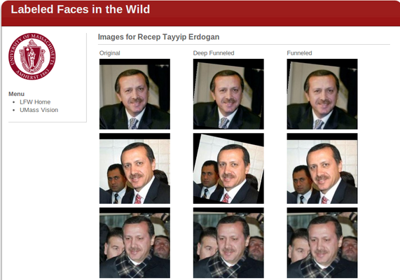
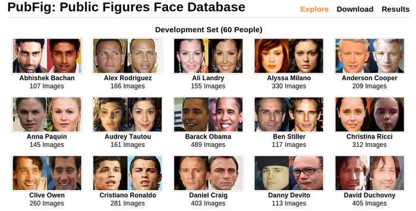

Popular Datasets in Computer Vision
====

There are several famous datasets that researchers use to benchmark their systems, e.g., Caltech101, Caltech256, ImageNet for object recognition; LFW and PubFig for face recognition.

ImageNet
---

ImageNet is an image database organized according to the WordNet hierarchy (currently only the nouns), in which each node of the hierarchy is depicted by hundreds and thousands of images. Currently ImageNet has 14,197,122 images and 21841 synsets indexed.

Website: http://image-net.org/about-overview

LFW: Labeled Faces in the Wild
---

LFW is published by the University of Massachusetts, which a database of face photographs designed for studying the problem of unconstrained face recognition. The data set contains more than 13,000 images of faces collected from the web. Each face has been labeled with the name of the person pictured. 1680 of the people pictured have two or more distinct photos in the data set. The only constraint on these faces is that they were detected by the Viola-Jones face detector.

Website: http://vis-www.cs.umass.edu/lfw/

Pubfig: Public Figures Face database
---

PubFig is a face database published by the University of Columbia, consisting of 58,797 images of 200 people collected from the internet. 
The database targets to be used in the task of face verification, i.e., given two faces, output whether they belong to the same person. Therefore it is split into a 60 people development set (used for developing the verification model) and a 140 people evaluation set (used to test the performance of the model).  In this way two people in the evaluation process have never been seen by the algorithm during training. 

Website: http://www.cs.columbia.edu/CAVE/databases/pubfig/

