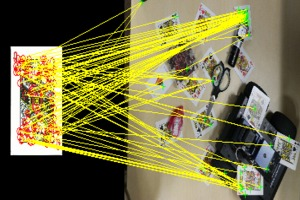
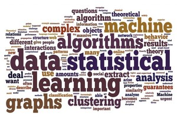

Academy
=======

This website is an internal repository of research materials, including study notes, slides, papers, codes and projects.
"Academy" is implemented with pure html and markdown, and can be simply hosted by a http server.

Feel free to clone it at https://github.com/t0nyren/academy.git

此网站为内部研发知识库，内容包含学习笔记，教程讲义，论文，代码演示等。欢迎大家共同编辑。

Computer Vision
----------

  
* [Feature Engineer](cv/features.md)
* [Representation](cv/representation.md)
* [Indexing Techniques](cv/indexing.md)
* [Face Detection](cv/face.md)
* Projects
   * [Similar image search](project/sise.md)
   * [Web-Level Face Recognition](project/welfare.md)
   
----------

Machine learning
-----------------

* [Linear regression](ml/regression.md)
* [SVM](ml/svm.md)
* [Neural Networks](ml/nnet.md)
* [Deep learning](ml/deeplearning.md)
* Projects
    * [Box office prediction](project/boxoffice.md) (票房预测）

----------

Networking
----------

* [P2P networks](networking/p2p.md)
