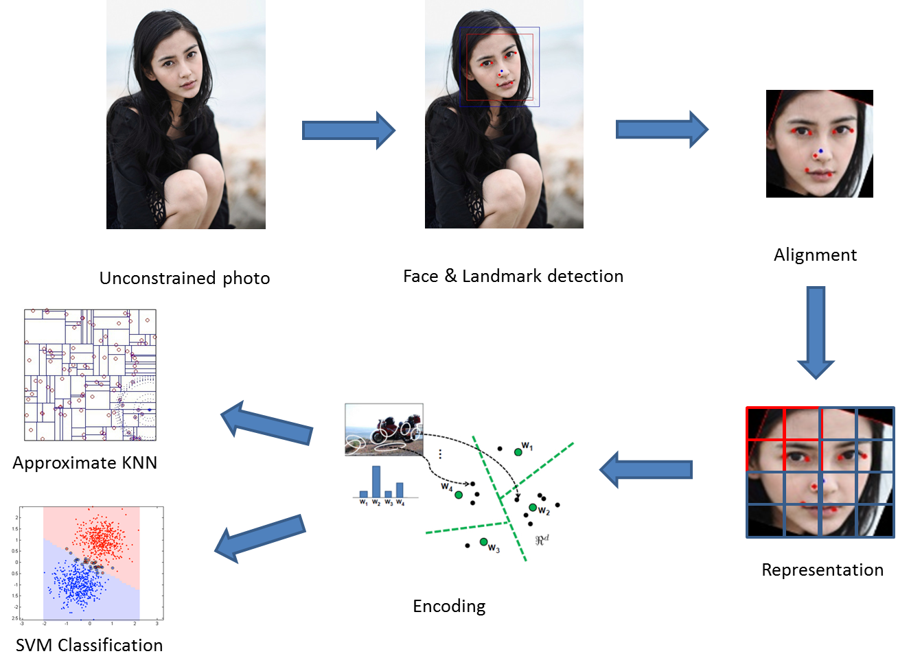
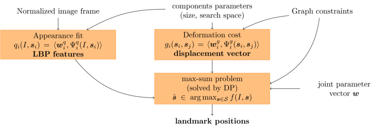
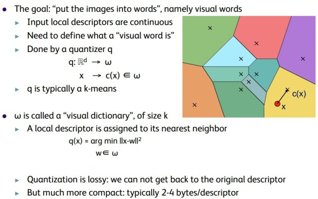
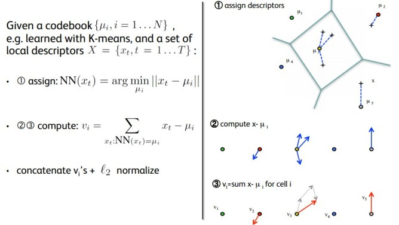
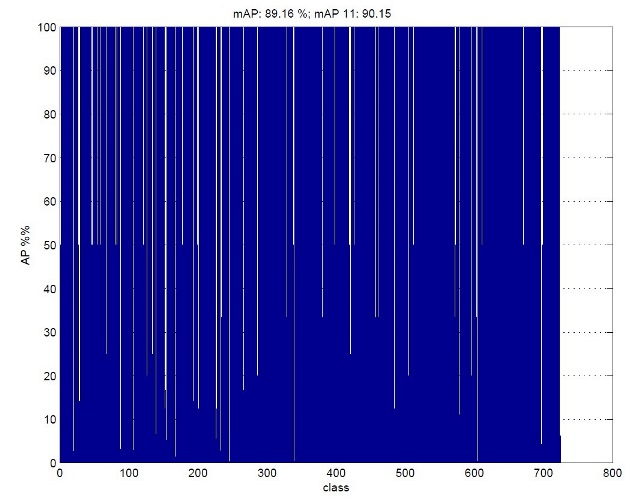

WELFARE stands for "Web-level Facial Recognition", which provides a complete list of tools for facial recognition tasks, including face detection, alignment, encoding, and classification. WELFARE targets for the unconstrained face recognition in natural environments, where faces are collected from the Internet.

Keywords: Cascade Classifier, Landmark Detection, Alignment, Dense SIFT, PCA, Bag-of-Visual-Words(BOVW), Vector of Locally Aggregated Descriptors(VLAD), SVM, randomized KD-Tree.

# Overview

The unconstrained face recognition is considered to be one of the most difficult tasks in computer vision. It usually involves the following steps: face detection, alignment, representation and classification. WELFARE uses multi-block LBP [1] to detect faces in photos, as well as eight facial landmarks. The detected face is aligned into a canonical form with eyes and mouth horizontally posed. After face is detected and aligned, it is represented by local features(DSIFT) [2], and then encoded into compact vector(VLAD) [3] for efficient searching and classification. Lastly WELFARE utilizes randomized-KDTree to find one (or several) most similar faces according to the similarities of their compact vectors. WELFARE can also identifies the input face as a specific person using SVM, given a pre-trained face database, such as PubFig [4], LFW [5], etc.



# Details

In this section we go through the details of each recognition step.

### 1. Face Detection

WELFARE uses the standard Cascade Classifier interface provided by OpenCV. The classifier is first trained by hundreds of positive examples of human faces with specific sizes, as well as a few negative examples. When a Cascade Classifier is trained, it scans through a image with a window of of the trained-size, and output possible human faces. By scaling the image, faces of different sizes can also be detected. The Cascade Classifier is generic model, which is transparent to the features used in training. Therefore various facial features can be used to train the classifier, e.g., Haar-like features, LBP features.

### 2. Facial Landmark Detection

WELFARE utilizes the flandmark[6] package to detect the eight facial landmarks, i.e., 4 canthi(the corner of an eye), 2 mouth corners, nose and face center. Please refer to their [website](http://cmp.felk.cvut.cz/~uricamic/flandmark/) for further details. 



### 3. Face Alignment

The alignment process makes use of the previously detected facial landmarks to adjust the face into a standard form. WELFARE first centers the face bounding box according to the detected face center. And then it calculates three angles: 1) the line between two outer eye corners, 2) the line between two inner eye corners, 3) the line between two mouth corners. The face is rotated by the median angle of the three lines.

```
angle_1 = atan(outer_eye_corners);
angle_2 = atan(inner_eye_corners);
angle_3 = atan(mouth_conrers);
rotateImg(median(angle_1, angle_2, angle3));
```

### 4. Dense SIFT Descriptor Extraction

WELFARE uses dense SIFT descriptors to represent the aligned face. There are other options of descriptors, such as LBP, to be explored. We uses the DISFT implementation of [VLFeat](http://www.vlfeat.org/).
The most major difference between dense SIFT and traditional SIFT is that, with dense SIFT, a SIFT descriptor is calculated at every location, while with traditional SIFT, descriptions are only calculated at the locations determined by Lowe's algorithm.
There are scenarios that the dense SIFT descriptor achieves better performance than normal SIFT, especially in recognition tasks, including face recognition.


### 5. PCA Dimension Reduction

After dense SIFT descriptors are extracted, we run Principle Component Analysis to reduce the dimensionality of the descriptors.

### 6. Bag-of-Visual-Words Projection

Bag-of-Visual-Words (BOVW) is used to reduce the dimensionality of the face representation, e.g., a 100X100 face has 2500 dsift descriptors of 128 dimension, which leads to a 320000 dimensional vector. In Bag-of-Visual-Words, a number of pre-defined centroids(visual words) are calculated in the Voronoi vector space using kmeans, and then each local descriptor is assigned to the visual word of its own Voronoi cell. The dimensionality of the face representation is significantly reduced.



### 7. Vector of Locally Aggregated Descriptors(VLAD) Encoding

BOVW only counts the number of local descriptors assigned to each Voronoi region. Other statistics, such as the geometry information and the distance to the local centroid are lost during the projection. The "Vector of Locally Aggregated Descriptors", a.k.a., VLAD captures the mean of local descriptors as well as their co-variance. It concatenates the aggregated vectors of each Voronoi region, and encodes the face into a single compact vector.



### 8. Classification via linear SVM

WELFARE uses simple linear SVM to build a classification model upon a dataset of labeled faces, e.g., LFW, PubFig, etc. Each face is encoded into a single VLAD vector _v_. Given a query face, its similarity to each class can be calculated simple by

`A = dot(w,v) + b`,
 
where "dot" stands for scalar product(dot product), and w, b are the normal vector and offset of the linear SVM model learned.

### 9. Similarity search via randomized KD-Tree

WELFARE also implements face similarity search by utilizing [FLANN](http://www.cs.ubc.ca/research/flann/)'s randomized KD-Tree. The randomized KD-Tree is an approximate K-NN algorithm that approximates a certain number of nearest neighbors of the input vector. The KD-Tree is first constructed by the VLAD vectors of the faces in the dataset (labeled or not). Upon each query request, the KD-Tree returns 3 most similar faces.

# Results

We have evaluated the performance of WELFARE on a web-scale dataset crawled from baidu.com. We collect over 50,000 images of 728 celebrities. We built our classification model by randomly selecting 30 faces from each celebrity class as training set for svm. The following figure shows the average precision (AP%) of each class. Note that WELFARE achieves over 90% mean average precision (mAP) of all celebrity classes. 



# Acknowledgement

1. [OpenCV](http://opencv.org/), the famous computer vision library. We use OpenCV for general purpose image processing, e.g., resize, rotation, transform RGB image to gray scale, etc.

2. [flandmark](http://cmp.felk.cvut.cz/~uricamic/flandmark/), an open-source implementation of facial landmark detector. We use the landmarks to align faces.

3. [VLFeat](http://www.vlfeat.org/), another open-source library that implements various computer vision algorithms. We use VLFeat for dsift feature extraction and VLAD encoding.

4. [FLANN](http://www.cs.ubc.ca/research/flann/), a fast library for approximate nearest neighbors. We use its KD-Tree implementation to search for similar faces.

# References
1. Liao, Shengcai, et al. "Learning multi-scale block local binary patterns for face recognition." _Advances in Biometrics. Springer Berlin Heidelberg, 2007._

2. A. Bosch, A. Zisserman, and X. Munoz. "Image classifcation using random forests and ferns." _In Proceedings of ICCV, 2007._

3. Arandjelovic, Relja, and Andrew Zisserman. "All about VLAD." _IEEE Conference on Computer Vision and Pattern Recognition(CVPR), 2013._

4. http://www.cs.columbia.edu/CAVE/databases/pubfig/

5. http://vis-www.cs.umass.edu/lfw/

6. M. Uricar, V. Franc and V. Hlavac, "Detector of Facial Landmarks Learned by the Structured Output SVM." _In Proceedings of the 7th International Conference on Computer Vision Theory and Applications, 2012._
